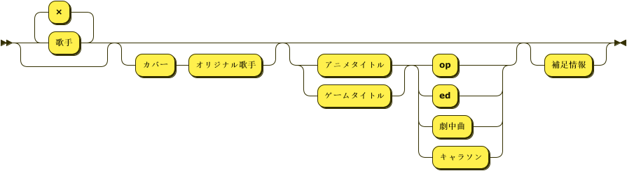

# セットリストのノート書き方

記載する順番についてルールを整理する。

```BNF
note ::= ( '歌手' ( '×' '歌手' )* )? ( '"カバー"' 'オリジナル歌手' )? ( ( 'アニメタイトル' | 'ゲームタイトル' ) ( '"op"' | '"ed"' | '"劇中曲"' | '"キャラソン"' ) )? '補足情報'?
```

<div style="background-color: #ffffff;">



</div>

作図参考

https://www.bottlecaps.de/rr/ui
